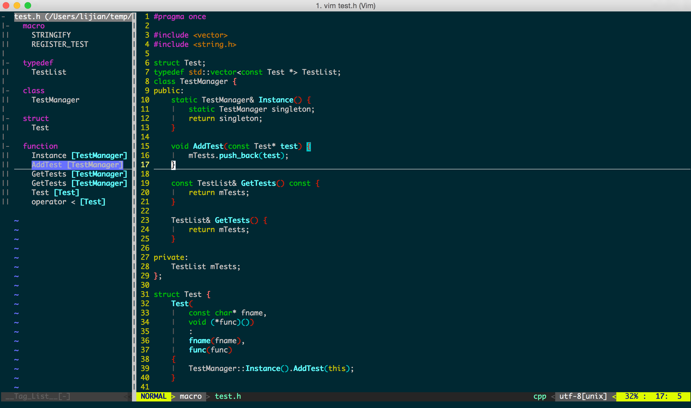

#vim

##vim简介

* Vim起源: ed -> sed -> Vi -> Vim(Vi IMproved)
* 作者: Bram Moolenaar
* 发行：1991.11.2 -- now(24年前)
* 版权：免费，开源，Vim License

    这是一个你不需要使用鼠标，不需使用小键盘，只需要使用大键盘就可以完成很多复杂功能文本编辑的编辑器。 
            --haoel

    对我来说 Vi 是禅,
      使用 Vi 就是使用禅。
    每个命令都是心印，
      这对用户来说是深奥的，
      对未入门者来说是无法了解的。
    每次使用它你都能发现真理。
                    --Satish Reddy

特点：

1. 跨平台及统一环境
    - Linux/Unix
    - OSX
    - iOS
    - Android
    - Windows
    - etc.
2. 高效命令行
    - 移动：h,j,k,l,f,g,...
    - 操作：x,y,p,d,...
    - 重复：q,.,;,,,...
    - 查找：\*,#,n,N,...
    - 与系统命令行结合：!, :, ...
    - etc.
3. 高度定制化和扩展 
    - 插件：ctrlp, syntastic, ...
    - 快捷键：map, nmap, vmap, ...
    - 自己定义函数：closePair, ...

##入门

看到这里的人，应该都是入了门的吧，^\_~，要不然可以先运行下`vimtutor`学习下，我这里也简单说一些。

### 存活下来

当你安装好一个编辑器后，你一定会想在其中输入点什么东西，然后看看这个编辑器是什么样子。但vim不是这样的，请按照下面的命令操作：

* 启动Vim后，vim在 Normal 模式下。
* 让我们进入 Insert 模式，请按下键 i 。
* 此时，你可以输入文本了，就像你用“记事本”一样。
* 如果你想返回 Normal 模式，请按 ESC 键。

现在，你知道如何在 Insert 和 Normal 模式下切换了。下面是一些命令，可以让你在 Normal 模式下幸存下来：

* i → Insert 模式，按 ESC 回到 Normal 模式.
* x → 删当前光标所在的一个字符。
* :wq → 存盘 + 退出 (:w 存盘, :q 退出) 
* dd → 删除当前行，并把删除的行存到剪贴板里
* p → 粘贴剪贴板

推荐:

* hjkl (强例推荐使用其移动光标，但不必需) →你也可以使用光标键 (←↓↑→). 注: j 就像下箭头。
* :help <command> → 显示相关命令的帮助。你也可以就输入 :help 而不跟命令。

你能在vim幸存下来只需要上述的那5个命令，你就可以编辑文本了，你一定要把这些命令练成一种下意识的状态。于是你就可以开始进阶到第二级了。

### 感觉良好

上面的那些命令只能让你存活下来，现在是时候学习一些更多的命令了，下面是我的建议：

1. 各种插入模式

    * a → 在光标后插入
    * o → 在当前行后插入一个新行
    * O → 在当前行前插入一个新行
    * cw → 替换从光标所在位置后到一个单词结尾的字符

2. 简单的移动光标

    * 0 → 数字零，到行头
    * ^ → 到本行第一个不是blank字符的位置（所谓blank字符就是空格，tab，换行，回车等）
    * $ → 到本行行尾
    * g\_ → 到本行最后一个不是blank字符的位置。
    * /pattern → 搜索 pattern 的字符串

3. 拷贝/粘贴
    * P → 粘贴
    * yy → 拷贝当前行当行于 ddP

4. Undo/Redo

    * u → undo
    * <C-r> → redo

5. 打开/保存/退出/改变文件(Buffer)

    * :e <path/to/file> → 打开一个文件
    * :w → 存盘
    * :saveas <path/to/file> → 另存为 <path/to/file>
    * :x， ZZ 或 :wq → 保存并退出 (:x 表示仅在需要时保存，ZZ不需要输入冒号并回车)
    * :q! → 退出不保存 :qa! 强行退出所有的正在编辑的文件，就算别的文件有更改。
    * :bn 和 :bp → 你可以同时打开很多文件，使用这两个命令来切换下一个或上一个文件。

花点时间熟悉一下上面的命令，一旦你掌握他们了，你就几乎可以干其它编辑器都能干的事了。但是到现在为止，你还是觉得使用vim还是有点笨拙，不过没关系，你可以进阶到下一级了。

##提高

在完成了入门后，在vim中就可以正常的编辑了。命令很多，很多人都会生出这样的问题，这些命令都要记吗？答案是YES。怎么记？重复！

### Don't repeat yourself(DRY)

`.`命令可以让我们重复上次的修改，它是Vim中最为强大的多面手。

`.`命令就是“重复上次修改”，这听起来很简单，但却是其高效的一个核心原因。Vim在面对重复工作时的一个思想就是`定位->操作`，在定位后，使用`.`命令可以快速的完成操作，然后进行下一个定位。

###认识模式
Vim和Vi一样具有三种模式：普通模式(normal mode)，插入模式(insert mode)和底线命令行模式(last line mode)。

当用户处于不同模式的时候，敲击键盘会产生不同的作用。

####普通模式
用户刚刚启动Vim，便进入了普通模式。

此状态下敲击键盘动作会被Vim识别为命令，而非输入字符。比如我们此时按下i，并不会输入一个字符，i被当作了一个命令。

以下是常用的几个命令：

    * i 切换到插入模式，以输入字符。
    * x 删除当前光标所在处的字符。
    * : 切换到底线命令模式，以在最底一行输入命令。
    * 若想要编辑文本：启动Vim，进入了普通模式，按下i，切换到输入模式。

 普通模式只有一些最基本的命令，因此仍要依靠底线命令行模式输入更多命令。

####输入模式
在普通模式下按下i就进入了输入模式。

在输入模式中，可以使用以下按键：

    * 字符按键以及Shift组合，输入字符
    * ENTER，回车键，换行
    * BACK SPACE，退格键，删除光标前一个字符
    * DEL，删除键，删除光标后一个字符
    * 方向键，在文本中移动光标
    * HOME/END，移动光标到行首/行尾
    * Page Up/Page Down，上/下翻页
    * Insert，切换光标为输入/替换模式，光标将变成竖线/下划线
    * ESC，退出输入模式，切换到命令模式

####底线命令模式
在普通模式下按下:（英文冒号）就进入了底线命令模式。

底线命令模式可以输入单个或多个字符的命令，可用的命令非常多。

在底线命令模式中，基本的命令有（已经省略了冒号）：

    * q 退出程序
    * w 保存文件
    * 按ESC键可随时退出底线命令模式。

###管理多个文件
Vim允许我们同时在多个文件上工作，缓冲区记录了一次编辑会话中打开的所有文件。

常用命令：

    :Ex                             : 开启目录浏览器，注意首字母E是大写的
    :Sex                            : 在一个分割的窗口中开启目录浏览器
    :cd ..                          : 进入父目录
    :args                           : 显示目前打开的文件
    :lcd %:p:h                      : 更改到当前文件所在的目录
    :ls                             : 显示当前buffer的情况
    :bn              : 跳转到下一个buffer
    :bp              : 跳转到上一个buffer
    :wn              : 存盘当前文件并跳转到下一个(又是“超级……”,ft!)
    :wp              : 存盘当前文件并跳转到上一个
    :bd              : 把这个文件从buffer列表中做掉
    :bun             : 卸掉buffer (关闭这个buffer的窗口但是不把它从列表中做掉)
    :badd file.c     : 把文件file.c添加到buffer列表
    :b 3             : 跳到第3个buffer
    :b main          : 跳到一个名字中包含main的buffer,例如main.c  

我自己就时常打开多个文件，使用`:ls`查看当前打开的文件，使用`:bN`进入对应的文件，`N`是文件编号。

###管理多窗口

在编辑文件时候，常常会参考其它的文件，这个时候多窗口并列可以很好的提高效率，这个时候可以使用操作系统的窗口分屏，也可以使用类`tmux`或`screen`这样的软件，不过Vim中已经自带了这样的功能，可以方便的使用多窗口，多窗口间共享了寄存器，方便内容的复制。

####分屏启动Vim

1. 使用大写的O参数来垂直分屏。

    vim -On file1 file2 ...

2. 使用小写的o参数来水平分屏。

    vim -on file1 file2 ...

注释: n是数字，表示分成几个屏。

####关闭分屏

1. 关闭当前窗口。

    Ctrl+W c

2. 关闭当前窗口，如果只剩最后一个了，则退出Vim。

    Ctrl+W q

####分屏

1. 上下分割当前打开的文件。

    Ctrl+W s

2. 上下分割，并打开一个新的文件。

    :sp filename

3. 左右分割当前打开的文件。

    Ctrl+W v

4. 左右分割，并打开一个新的文件。

    :vsp filename

####移动光标

Vi中的光标键是h, j, k, l，要在各个屏间切换，只需要先按一下Ctrl+W

1. 把光标移到右边的屏。

    Ctrl+W l

2. 把光标移到左边的屏中。

    Ctrl+W h

3. 把光标移到上边的屏中。

    Ctrl+W k

4. 把光标移到下边的屏中。

    Ctrl+W j

5. 把光标移到下一个的屏中。.

    Ctrl+W w

####移动分屏

这个功能还是使用了Vim的光标键，只不过都是大写。当然了，如果你的分屏很乱很复杂的话，这个功能可能会出现一些非常奇怪的症状。

1. 向右移动。

    Ctrl+W L

2. 向左移动

    Ctrl+W H

3. 向上移动

    Ctrl+W K

4. 向下移动

    Ctrl+W J

####屏幕尺寸

下面是改变尺寸的一些操作，主要是高度，对于宽度你可以使用[Ctrl+W <]或是[Ctrl+W >]，但这可能需要最新的版本才支持。

1. 让所有的屏都有一样的高度。

    Ctrl+W =

2. 增加高度。

    Ctrl+W +

3. 减少高度。

    Ctrl+W -

###移动及跳转

在编辑、阅读文件时，光标的移动是非常频繁的，这个时候可以使用鼠标，不过鼠标在定位时也不能很精确，这个时候就可以看看Vim中对移动和跳转的设计思想。下面以移动的范围为标准进行说明，这些移动都是在普通模式下！

按键 | 说明
---- | --- 
h <left> | 将光标向左移动一个位置
l <right> | 将光标向左移动一个位置
j <down> | 将光标向下移动一个位置 
k <up> | 将光标向上移动一个位置 
- | 将光标移动到上一行的开头
+ | 将光标移动到下一行的开头
^ | 将光标移动到当前行的第一个非空格字符上
0 | 将光标移动到当前行的开始
$ | 将光标移动到当前行的末尾
w W |  将光标移动到下一个单词的词首（大写字母，略过空格）
e E | 将光标移动到下一个单词的词尾（大写字母，略过空格）
b B |  将光标移动到上一个单词的词首（大写字母，略过空格）
）| 向前移动到下一个句子
（| 向后移动到上一个句子
{ | 向前移动到下一个段落
} | 向后移动到上一个段落
H | 将光标移动到屏幕顶部
M | 将光标移动到屏幕中间
L | 将光标移动到屏幕的最后一行
% | 已匹配一个括号为目的的移动
nG :n | 跳转到第n行
1G gg :1 | 跳转到编辑缓冲区的第一行
G :$ | 跳转到编辑缓冲区最后一行
\# | 正向搜索光标下单词
% | 反向搜索光标下单词
n | 搜索中的下一个位置
N | 搜索中的上一个位置

下面要隆重的推出字符查找功能，Vim的字符查找命令可以让我们在行内快速移动,也就是`f{char}`,这是Vim中移动的最快方式之一。在按下`f`后，再加一个字符，这时光标就会正向查找这个字符，如果找到就会移动至匹配的字符上，可以使用`;`和`,`找下一个或者上一个出现的字符(这也就是为什么我把Vim的leader设置为空格，面不是逗号了，因为逗号实在是很重要)。

按键 | 说明
---- | --- 
f{char} | 正向移动到下一个{char}所在
F{char} | 反向移动下上一个{char}所在
t{cahr} | 正向移动到下一个{char}所在的前一个字符
T{cahr} | 反向移动到上一个{char}所在的后一个字符
; | 重复上次的字符查找命令
, | 反转方向查找上次的字符查找命令

###宏

宏是一段修改序列记录下来，之后回放。Vim在面对重复工作时的一个思想就是`定位->操作`，在定位后，使用宏可以快速的完成操作，然后进行下一个定位。

宏的录制过程：
1. q{char}, q后面加一个字母用来标记宏的名字
2. i;...<ESC>, 一些操作，基于是任意的操作，最后加到普通模式就好。
3. q, 使用q结束
4. @{char}, 使用`@`加宏的名字就会播放宏了
5. @@， 播放上一个播放的宏

##插件管理

上面的介绍只是Vim中常用的一角，已经可以提高不小的工作效率了，当然也淘汰了大部分的用户了，我自己就曾经多次的弃用vim，而后又硬着头皮上。不过插件的使用，可以让一些操作得到加强，难度希望可以变小点。:smile:

1. 插件管理 [gmarik/vundle](https://github.com/gmarik/vundle)

    必装,用于管理所有插件
    命令行模式下管理命令:

        :PluginInstall     install
        :PluginInstall!    update
        :PluginClean       remove plugin not in list
        
2. 多语言语法检查 [scrooloose/syntastic](https://github.com/scrooloose/syntastic)

    建议安装，静态语法及风格检查,支持多种语言

3. 自动补齐 [Shougo/neocomplcache.vim](https://github.com/Shougo/neocomplcache.vim)

    有更加强大的YCM（you complete me)不过，这个现在就够用了

4. 代码片段[Shougo/neosnippet](https://github.com/Shougo/neosnippet)

5. 打开文件[kien/ctrlp.vim](https://github.com/kien/ctrlp.vim)

有了管理插件的插件，再也不用担心插件不好管理了。*_* 

##我的vim

我的vim就在了[github](https://github.com/hustlijian/dotfiles)上，有兴趣的可以看看。

安装方法如下：

    git clone https://github.com/hustlijian/dotfiles.git
    cd dotfiles
    make vim

效果：

##参考

* [简明Vim练级攻略](http://coolshell.cn/articles/5426.html)
* [Learn Vim Progressively](http://yannesposito.com/Scratch/en/blog/Learn-Vim-Progressively/)
* [hotoo vim](http://wiki.hotoo.me/Vim.html)
* [k-vim](https://github.com/wklken/k-vim)
* [vim-tips.txt](http://www.2maomao.com/blog/wp-content/uploads/vim_tips.txt)
* [awesome vim](http://getawesomeness.com/get/vim)
* [vim bootstrap](http://vim-bootstrap.com/)
* [awesome vim plugin](http://vimawesome.com/)
* [vim document](http://vim.wikia.com/wiki/Vim_documentation)
* [Vim的分屏功能](http://coolshell.cn/articles/1679.html)
